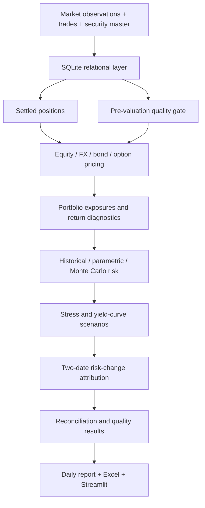

# Institutional Portfolio Risk & Fixed-Income Analytics

A multi-asset risk platform that turns a trade ledger and market observations into portfolio values, bond analytics, VaR and Expected Shortfall, stress losses, risk-change attribution and operational exceptions.

**Business question:** What risks does the portfolio hold, how could it lose money, and why did its risk change since the previous valuation date?

The project uses transparent Python functions, meaningful SQLite tables, an interactive Streamlit dashboard and a formula-linked Excel report. Core bond mathematics is implemented directly. This is a student finance project designed to be studied from cash flows through portfolio conclusions.


## Run it

Python 3.11+ is required. Run commands from the repository root. The first installation needs package-registry access; the sample analytics run offline.

```powershell
python -m venv .venv
.\.venv\Scripts\python.exe -m pip install -r requirements.txt
.\.venv\Scripts\python.exe main.py demo
.\.venv\Scripts\python.exe -m streamlit run dashboard/app.py
```

On macOS/Linux, replace `.\.venv\Scripts\python.exe` with `.venv/bin/python`. Open the local URL printed by Streamlit. The demo builds SQLite, values both dates, runs 10,000 Monte Carlo scenarios and writes `outputs/daily_risk_report.md`, `risk_report.json`, CSV tables and charts.

`requirements-lock.txt` records the exact package versions verified on Windows/Python 3.13. Install that file instead of `requirements.txt` when reproducing the tested environment. Optional notebooks: `python -m pip install -e ".[notebooks]"` and `python -m jupyterlab notebooks/`.

```powershell
# Automated financial and integration tests
.\.venv\Scripts\python.exe -m pytest -q

# Real archived Bank of Canada FX + explicitly synthetic other markets
.\.venv\Scripts\python.exe main.py mixed-demo

# Import your own CSVs into a new database
.\.venv\Scripts\python.exe main.py import --input data/my_import --database data/my_portfolio.db
.\.venv\Scripts\python.exe main.py run --config config/my_portfolio.yaml --database data/my_portfolio.db --output outputs/my_portfolio
```

The mixed example has a separate database and writes to `outputs/mixed/`. Enter that directory in the dashboard's report-folder field to inspect it. Existing databases are reused: editing a CSV does not silently overwrite stored observations. Use a new database path when changing the imported dataset. Configuration is in [config/portfolio.yaml](config/portfolio.yaml); import details are in [data/README.md](data/README.md).

### Excel

Open the included [risk_reporting_model.xlsx](models/risk_reporting_model.xlsx). It contains 16 sheets: summary, positions, trades, security master, market observations, fixed income, VaR, ES, contributions, stress, yield curves, attribution, data quality, daily notes and reconciliations.

```powershell
python main.py demo --excel
# Or regenerate from an existing report:
python main.py excel --output outputs
```

**Excel regeneration has an additional dependency:** the Codex bundled Node runtime and `@oai/artifact-tool`. The exporter finds the standard local runtime automatically. On another installation, set `ARTIFACT_NODE` to its Node executable and `ARTIFACT_MODULES` to its `node_modules` folder containing that package. Ordinary `pip install` does not provide this runtime. The included workbook can be opened independently; the Python engine, tests, CSV/Markdown reports and dashboard do not depend on it.

Workbook NAV, allocations and reconciliation checks recalculate from worksheet inputs. VaR, ES and other nonlinear analytics are Python result snapshots; rerun Python to refresh them. Editing a position in Excel does not silently recalculate a new Monte Carlo distribution.

## Architecture



The same full-repricing function is used for ordinary valuation, historical simulation, Monte Carlo and stress. Reports consume calculated results rather than implementing another risk engine. SQL enforces primary/foreign keys, derives settled holdings, stores dated valuations and risk runs, and supports exposure and exception queries.

## What is implemented

| Area | Working functionality |
|---|---|
| Fixed income | Coupon schedules, clean/dirty prices, accrued interest, numerical YTM, Macaulay/modified duration, full-bump DV01, analytic convexity |
| Derivative | European Black–Scholes call/put, delta/gamma/vega/theta, full scenario repricing |
| Portfolio | CAD/USD conversion, signed units and multipliers, average-cost book values, exposure aggregation, hypothetical return/benchmark diagnostics |
| Market risk | One-day 95%/99% historical, Gaussian parametric and correlated Monte Carlo VaR/ES; sample covariance; reproducible seed |
| Contributions | Security-level marginal and component parametric VaR; asset-class/currency/sector aggregation; diversification comparison |
| Stress | Recession, inflation, credit crisis, equity crash, custom shocks, parallel/steepener/flattener/key-rate curves |
| Attribution | Positions, prices, FX, rates, option volatility, calibrated factor volatility, correlation and date roll; interaction evidence and numerical residual |
| Operations | Missing/stale prices and FX, unmapped securities/factors, invalid terms, duplicate trades, cash funding, position/value reconciliation, history gaps and outliers |
| Reporting | Daily Markdown/JSON/CSV, interactive charts, six dashboard pages, Excel formulas and audit checks |

The portfolio includes Canadian and US equity baskets, Canadian government/corporate bonds, a Treasury ETF proxy, CAD/USD cash and a small vanilla call. The baseline is approximately CAD 101.4 million. The portfolio is hypothetical; every synthetic market row is labelled.

## Demonstration findings

For the synthetic portfolio at August 31, 2026, with 252 synchronized daily observations and seed 42:

| One-day method | 95% VaR | 99% VaR | 99% Expected Shortfall |
|---|---:|---:|---:|
| Historical | CAD 0.959m | CAD 1.172m | CAD 1.222m |
| Parametric | CAD 0.958m | CAD 1.355m | CAD 1.552m |
| Monte Carlo | CAD 0.964m | CAD 1.340m | CAD 1.523m |

These are **demonstration results, not estimates for a real investment portfolio**. Equities dominate market value and component VaR. The option's small market value conceals nonlinear exposure, which is why it is repriced in scenarios. Parallel rate increases reduce both bond values; convexity explains part of the difference from a linear rate approximation. The 99% parametric VaR falls by about CAD 13,248 between the two dates, with market prices, calibrated equity volatility and correlation contributing most to the decline. Exact results and assumptions are saved with each run.

## Flagship feature: why risk changed


The attribution module recalibrates risk separately at each date, then replaces economic inputs in two opposite orders and averages the resulting driver allocations. It shows the difference from changing each driver alone, so interactions remain visible. The bridge reconciles to the change in 99% parametric VaR, but is explicitly a model-dependent allocation rather than causal identification or an all-permutations Shapley decomposition.

## Methodology and limits

Read [the methodology guide](reports/risk_methodology.md) for formulas, units, sign conventions, assumptions and validation evidence. The [daily example report](reports/sample_daily_risk_report.md) shows the complete analyst output.

- VaR/ES are nonnegative losses; P&L is positive for gains. All headline money values are CAD.
- Log price/FX shocks and absolute rate/spread/volatility shocks use matching sensitivities and covariance units.
- Historical and Monte Carlo scenarios fully reprice instruments. Parametric risk uses local linear sensitivities and a Gaussian approximation.
- Risk is one-day instantaneous shock risk. No unsupported square-root scaling is applied to nonlinear holdings.
- Missing history is never forward-filled. Critical data failures block calculation and are stored as SQL exceptions.
- The historical performance chart is a **frozen-exposure scenario replay**, not a realized strategy backtest.
- Only the archived/mixed FX observations are real. Bond terms, equity markets, curves, other risk factors and portfolio holdings are synthetic. Real input paths are documented.
- Regular-coupon bonds, continuous zero curves and European options have explicit simplifications. No swaps, default model, liquidity model or automatic corporate-action posting is claimed.

## Validation

Tests check economic behaviour as well as formulas: independent bond benchmarks; negative-yield round trips; duration/DV01 derivatives; convexity approximation improvement; option parity and Greeks; no-look-ahead/gap handling; VaR confidence and volatility ordering; Monte Carlo covariance/seed recovery; Euler/marginal reconciliation; negative hedge contributions; stress signs; attribution interactions; and injected operational failures. Integration tests exercise a fresh SQLite database, persisted reports, all six Streamlit pages and a custom scenario. Excel formulas are recalculated, reconciled and visually inspected after export.

## Explore the code

```text
config/          Portfolio settings and named stress assumptions
data/            Labelled sample inputs, real FX archive, import contract
sql/             Schema, analytical views and finance queries
src/data/        CSV imports, public FX adapter, reproducible sample
src/database/    SQLite access, settled quantities and average cost
src/pricing/     Transparent bond and option calculations
src/portfolio/   Shared repricing, valuation, returns and performance
src/risk/        VaR, ES, covariance, simulation and contributions
src/stress/      Full-repricing stress and key-rate curves
src/attribution/ Two-date economic-driver attribution
src/controls/    Data, trade and valuation checks
src/reporting/   Daily reports, charts and Excel export
dashboard/       Streamlit application
notebooks/       Four short guided explorations
reports/         Methodology and saved demonstration report
tests/           Unit, financial-property and integration tests
PLAN.md          Architecture, phased milestones and completion evidence
```

Suggested reading order: bond cash flows → portfolio unit values → risk factor changes → VaR/ES → Euler contributions → attribution. The four notebooks explore portfolio exposures, fixed income, tail risk and stress testing. They require the demo outputs and a Jupyter environment; their calculations reuse the Python modules.

**Stack:** Python, pandas, NumPy, SciPy, SQLite, YAML, Plotly, Matplotlib, Streamlit, Excel and pytest. Core financial calculations do not require QuantLib. The implementation favours short functions and ordinary data frames over a service framework or ORM.
