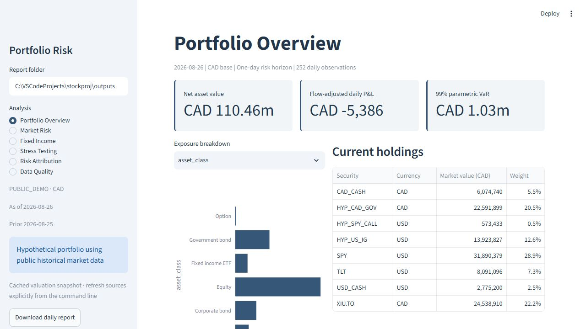
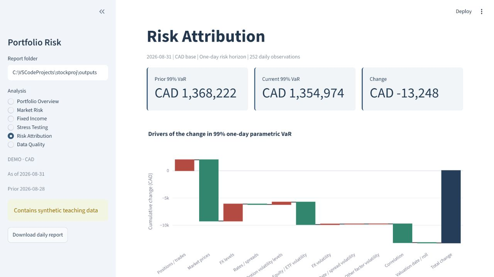

# Portfolio Risk & Fixed-Income Analytics

**What risks does the portfolio hold, how could it lose money, and why did its risk change since the previous valuation date?**

**Data note:** This project evaluates a hypothetical multi-asset portfolio using public historical market data. XIU.TO, SPY and TLT prices come from Yahoo Finance; USD/CAD and Canadian zero curves from the Bank of Canada; US zero curves from the Federal Reserve; investment-grade spreads from FRED; and VIX from Yahoo. Holdings, trades, bond terms and the European SPY call contract are hypothetical. These are cached historical valuations, not live quotes or actual investment performance.




**Live dashboard:** Not deployed. Run the Streamlit app locally using the instructions below.

## What I built

- **Portfolio & data:** trade ledger, settlement-date positions, SQLite storage, CAD/USD valuation and data-quality gates.
- **Fixed income & options:** direct bond pricing, YTM, duration, DV01, convexity, curve/spread repricing and European option Greeks.
- **Market risk:** historical, parametric and Monte Carlo VaR/Expected Shortfall, parametric component risk, stress testing and risk-change attribution.
- **Reporting:** six-page Streamlit dashboard, 16-sheet Excel workbook, Markdown/CSV/JSON reports and four exploratory notebooks.

## Key sample results

Public-data hypothetical portfolio as of August 26, 2026 (prior August 25), using 252 synchronized daily observations and 10,000 Monte Carlo simulations with seed 42. The Canadian zero-curve publication lag determines the valuation cutoff:

| Measure | Result |
|---|---:|
| Portfolio NAV | CAD 110.46 million |
| 99% one-day parametric VaR | CAD 1.029 million |
| 99% one-day Monte Carlo VaR | CAD 1.000 million |
| Largest component-risk group | Equity |
| Equity-crash scenario P&L | CAD −15.50 million |

See the [sample daily report](reports/sample_daily_risk_report.md) for detailed results and assumptions.

## Data sources

| Input | Public source / convention |
|---|---|
| XIU.TO, SPY, TLT | Yahoo Finance via yfinance; close for marks, adjusted close for return shocks |
| USD/CAD | [Bank of Canada Valet](https://www.bankofcanada.ca/valet/docs/), FXUSDCAD; CAD per USD |
| CAD zero curve | [Bank of Canada](https://www.bankofcanada.ca/rates/interest-rates/bond-yield-curves/), 1/2/5/10/30 years |
| USD zero curve | [Federal Reserve GSW](https://www.federalreserve.gov/data/nominal-yield-curve.htm), SVENY01/02/05/10/30 |
| USD investment-grade spread | [FRED BAMLC0A0CM](https://fred.stlouisfed.org/series/BAMLC0A0CM), index OAS proxy |
| Option volatility | Yahoo ^VIX; 30-day S&P 500 proxy, divided by 100 |
| Ownership and instrument terms | Hypothetical holdings/trades; hypothetical bonds and European SPY call |

## How it works

```text
Market data + trades + security master → SQLite → settled positions → pricing
→ portfolio risk → stress / yield curves → risk attribution → reports
```

Controls check inputs before valuation and reconcile positions afterward. The same repricer values current holdings and applies historical, simulated and stress shocks. SQLite stores observations, dated positions, risk runs and exceptions.

### Risk change attribution

The two-date bridge separates position, price, FX, rate, volatility and correlation changes. It averages forward and reverse input-replacement paths and reports interaction effects and numerical residuals. The bridge is a model-dependent allocation, not causal attribution or a full Shapley decomposition.

## Tech stack

Python, pandas, NumPy, SciPy, SQLite, Streamlit, Plotly, Matplotlib, Requests, yfinance, PyYAML, XlsxWriter, openpyxl and pytest. Notebooks use Jupyter. Core pricing is implemented directly without a financial pricing library.

## Methodology summary

- Holdings use signed settled trades, explicit cash entries, contract multipliers and CAD conversion rates.
- Bonds use discounted cash flows; YTM, duration, DV01 and convexity have explicit compounding and sign conventions.
- Historical and Monte Carlo risk fully reprice instruments. Parametric VaR uses local sensitivities and sample factor covariance.
- Stress tests reprice simultaneous equity, rate, spread, FX and volatility shocks. Curve scenarios include parallel moves, steepening and flattening.
- Missing critical inputs block calculation. Historical gaps are not forward-filled.

Formulas, conventions and model limits are in the [methodology guide](reports/risk_methodology.md). Data sources and import requirements are in [data/README.md](data/README.md).

## Repository structure

```text
src/data/         Public downloads, verified snapshots and hypothetical holdings
src/database/     SQLite access and settled positions
src/pricing/      Bond and European option mathematics
src/portfolio/    Shared valuation, returns and performance diagnostics
src/risk/         VaR, ES, covariance, simulation and contributions
src/stress/       Macro and yield-curve scenarios
src/attribution/  Two-date risk-change explanation
src/controls/     Data and reconciliation checks
src/reporting/    Reports, charts and Excel export
sql/              Schema, views and analytical queries
config/           Portfolio settings and scenario assumptions
dashboard/        Streamlit application
models/           Included Excel workbook
notebooks/        Four finance explorations
reports/          Methodology, validation and sample report
tests/fixtures/   Deterministic synthetic tests, separate from portfolio inputs
```

## Run locally

Python 3.11+ is required. From the repository root on Windows PowerShell:

```powershell
python -m venv .venv
.\.venv\Scripts\Activate.ps1
python -m pip install -r requirements.txt
python main.py refresh --start 2023-09-01 --end 2026-08-31
python main.py demo --excel
streamlit run dashboard/app.py
```

On macOS/Linux, activate with `source .venv/bin/activate`. Open the local URL printed by Streamlit. The first refresh requires internet access. Subsequent `demo` runs reuse the verified local snapshot without network access and write reports to `outputs/`. Public-feed CSV caches are excluded from Git; refresh them locally. Refresh failures name the source and preserve the previous working configuration. There is no random-data fallback.

Open [risk_reporting_model.xlsx](models/risk_reporting_model.xlsx), or regenerate it with `python main.py excel --output outputs`. Excel generation uses the standard Python dependencies. NAV, weights, allocations and checks are formulas; VaR/ES and other risk analytics are Python snapshots and require another Python run after inputs change. Cached formula values support previews; a spreadsheet calculation engine recalculates edits.

See the [data instructions](data/README.md) for source identifiers, units, offline rebuilds, cache locations and import commands. Each successful refresh creates a new snapshot and database path. Install optional notebook tools with `python -m pip install -e ".[notebooks]"`. Exact validated package versions are in `requirements-lock.txt`.

## Validation

Run `python -m pytest -q`. The automated suite covers pricing formulas, portfolio valuation, VaR/ES behavior, stress, SQL integration, attribution, data-quality gates, dashboard interactions and workbook consistency. See the [validation record](reports/VALIDATION.md) for test counts and evidence.

## Limitations

Holdings and contract terms are hypothetical. Public feeds are not equivalent to Bloomberg/Refinitiv. The USD corporate bond uses an index OAS proxy; the European call uses VIX rather than contract-specific IV. Published zero curves are fitted estimates and can be revised; this is not a historical as-published trading backtest. The performance series is a frozen-exposure hypothetical replay, not a realized strategy backtest. Risk is one-day instantaneous shock risk with Gaussian Monte Carlo factors and a limited historical tail. Bonds and European options use simplified conventions; there is no default, liquidity, transaction-cost or automatic corporate-action model. Reporting supports CAD base with CAD/USD holdings. The app is local and has no live production deployment.
